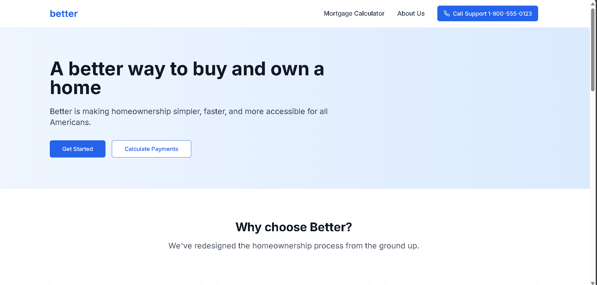
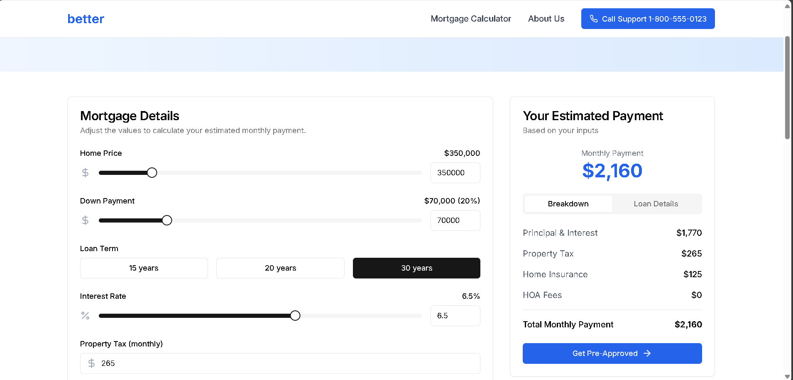

# Better Mortgage Calculator

A modern mortgage calculator and loan application system built with Next.js and TypeScript, featuring a clean and intuitive user interface.

### Homepage


### Mortgage Calculator


## Features

- Interactive mortgage calculator with real-time updates
- Loan application workflow
- Support call system
- Toast notifications
- Responsive design for mobile and desktop
- Modern UI components using shadcn/ui

### Mortgage Calculator

- Real-time payment calculations
- Adjustable inputs for:
  - Home price
  - Down payment
  - Loan term
  - Interest rate
  - Property tax
  - Home insurance
  - HOA fees
- Detailed payment breakdown
- Loan details summary

### Loan Application

- Two-step application process:
  1. Loan purpose selection (Purchase/Refinance)
  2. Property details collection
- Success notifications
- Seamless navigation

### Support System

- Click-to-call functionality
- Mobile-responsive support access
- Integrated contact buttons

## Technology Stack

- Next.js 14
- TypeScript
- Tailwind CSS
- shadcn/ui components
- React Hook Form
- Zod validation

## Getting Started

1. Clone the repository

```bash
git clone https://github.com/Priyanshuraj21030/Medius
```

2. Install dependencies:

```bash
npm install
```

3. Start the development server:

```bash
npm run dev
```

4. Open your browser and navigate to `http://localhost:3000` to view the application.


## Acknowledgments

- [Next.js](https://nextjs.org/)
- [Tailwind CSS](https://tailwindcss.com/)
